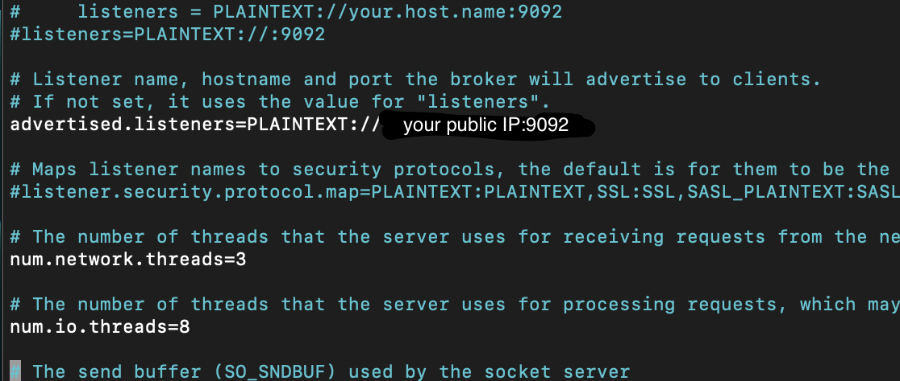

# StockMarketAnalysis
Analysing Stock Market Data using Kafka  
 
This a project that I am developing for learning purposes. I have used this youtube video for reference :  [Stock Market Real-time Data Analysis using Kafka](https://www.youtube.com/watch?v=KerNf0NANMo)

---
 

# Steps in the project

- [Setting up EC2 Instance](#setting-up-EC2-Instance)    
- [Downloading Kafka on EC2 Instance](#downloading-Kafka-on-EC2-Instance)
- [Starting Zookeeper and Kafka server on local machine](#starting-Zookeeper-and-Kafka-server-on-local-machine)
- [Creating topic on Kafka server](#creating-topic-on-Kafka-server)
- [Creating producer and consumer on our server](#creating-producer-and-consumer-on-our-server)
- [Writing python code for Kafka producer and consumer in python on Jupyter Notebook](#writing-python-code-for-Kafka-producer-and-consumer-in-python-on-Jupyter-Notebook)
- [Simulating realtime data using a dataset](#simulating-realtime-data-using-a-dataset)
- [Setting up S3 Bucket](#setting-up-S3-Bucket)
- [Setting up Glue crawler](#setting-up-Glue-crawler)
- [Quering our data using AWS Athena](#quering-our-data-using-AWS-Athena)

## Setting up EC2 Instance

First, [Create an AWS Account](https://portal.aws.amazon.com/billing/signup?nc2=h_ct&src=header_signup&redirect_url=https%3A%2F%2Faws.amazon.com%2Fregistration-confirmation#/start/email) and activate it, which will take approximately 24 hours.

Steps to follow after activation:
1. On AWS Console, search for EC2
2. Go to the EC2 dashboard, then click on **Instances(running)** tab and the go to **Launch Instance**
3. Create a instance name for this project.
4. As you scroll down, you will find a box of key-pair(login), click on **Create a new key-pair**
    - Create a unique name for this key-pair
    - Choose RSA 
    - Create a key pair

> **Important:** Save the key-pair properly in a folder

5. Keep all the other settings to default, and then Launch Instance.

You can find the instance on the EC2 Dashboard under the Instances(running) tab.

## Downloading Kafka on EC2 Instance

Connecting EC2 Instance to local Machine:
1. Go to the Instance by clicking on the instance ID.
2. Click on Connect.
3. Use the SSH Client command, run it on your terminal
4. This will connect your local machine to the AWS EC2 Instance.

> If you get an error use the following command : ''' chmod 400 {your_key_name.pem}'''

Downloading Kafka on your EC2 Instance
1. On EC2 terminal, download Kafka using the following command
'''wget https://downloads.apache.org/kafka/3.5.0/kafka_2.12-3.5.0.tgz'''
2. Uncompress the file using the following command
'''tar -xvf kafka_2.12-3.5.0.tgz'''
3. Use ls to check if the file is succesfully uncompressed.

> To run Kafka successfully we will need JVM as Apache Kafka runs on it.

Download JVM on EC2 using the following command (Amazon-linux 2): 
'''sudo yum install java-1.8.0-openjdk''' 

If you are using Amazon Linux 2023 then use this commands:
'''
sudo dnf update -y
sudo dnf install java-17-amazon-corretto-devel
'''

In Amazon Linux 2023 the default package management tool is  'dnf' which is the successor of 'yum', in Amazon Linux 2

## Starting Zookeeper and Kafka server on local machine

Starting Zookeeper:
1. Open EC2 Terminal, then open the kafka folder on the terminal.
2. Use the following command to start the Zoopkeeper.
'''bin/zookeeper-server-start.sh config/zookeeper.properties'''
3. This will start the Zookeeper on the EC2 Instance.

Starting Kafka Server:
1. Open a new EC2 Terminal, now we need to increase the memory of our kafka server. Use the following command to do so.
'''export KAFKA_HEAP_OPTS="-Xmx256M -Xms128M"'''
2. Open kafka folder in the terminal and start the kafka server using this command
'''bin/kafka-server-start.sh config/server.properties'''
3. After starting the Kafka server, you can just scroll the logs on the terminal to see the IP on which the server runs, and it is the private IP of the EC2 Instance, using private IP will restrict from sending data from our local machine. This can only me done if both are on the same network. So, to complete this project, we change the IP in the configure file to the public IP of the instance.

Changing the IP:
1. Stop Zookeeper and Kafka server.
2. Navigate to kafka folder on the EC2 terminal and use this command
'''sudo nano config/server.properties'''
3. Change the **ADVERTISED_LISTENERS** to public IP of the EC2 instance
4. Save the changes and run Zookeeper and Kafka server again.

Changes should look this: 

## Creating topic on Kafka server

Before we create a topic we need to change the security settings to allow requests from our local machine to EC2 server.

Changing security groups:
1. Open EC2 Dashboard, goto the instance dashboard.
2. Scroll down to select the security tab, click on the security groups ID present there.
3. Click on the tab to Edit the inbound rules.
4. Add a new rule with the following choices:
**Type**: All Traffic
**Source**: Anywhere IPv4
5. Save rules

> This is not the best practice, but for simplicity we use this.

Topic on Kafka server:
1. Open a new EC2 Terminal and open the kafka folder.
2. Use the following command to create a new topic.
'''bin/kafka-topics.sh --create --topic {your_topic_name} --bootstrap-server {public_IP_EC2:9092} --replication-factor 1 --partitions 1'''
3. This will create a new topic.

## Creating producer and consumer on our server

Open two EC2 terminals, one for consumer and the other for producer, and navigate to the kafka folder 

1. Producer
'''bin/kafka-console-producer.sh --topic {your_topic_name} --bootstrap-server {public_IP_EC2:9092}'''
2. Consumer
'''bin/kafka-console-consumer.sh --topic {your_topic_name} --bootstrap-server {public_IP_EC2:9092}'''

This will start your producer and consumer.

## Writing python code for Kafka producer and consumer in python on Jupyter Notebook
## Simulating realtime data using a dataset
## Setting up S3 Bucket
## Setting up Glue crawler
## Quering our data using AWS Athena

Credits : Darshil Parmar [Stock Market Project](https://www.youtube.com/watch?v=KerNf0NANMo)

